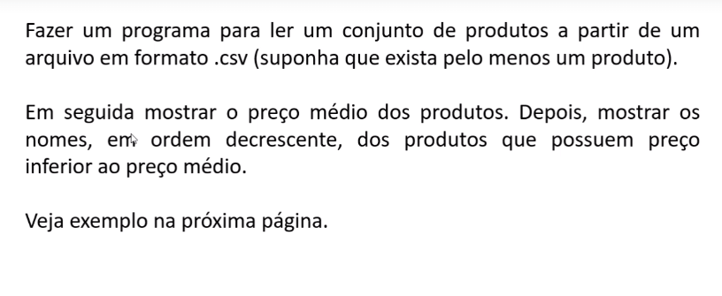
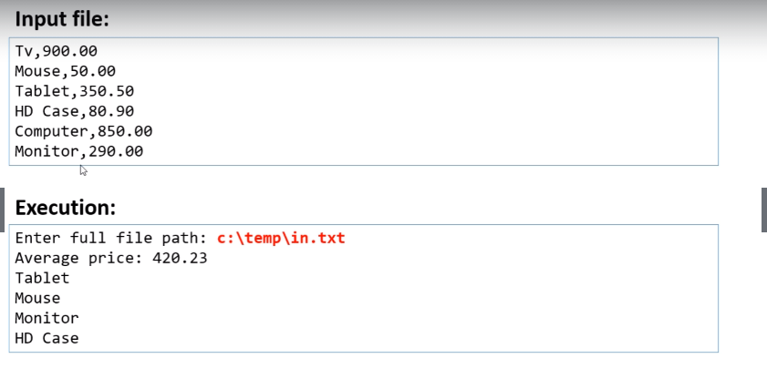

# stream-java
## Java - utilizando stream, BufferedReader, List e Comparator.

------------------------------------------------------------------------------------

------------------------------------------------------------------------------------

Criar um arquivo **in.txt** em **c:\temp**, com o seguinte conteúdo:

Tv,900.00  
Mouse,50.00  
Tablet,350.50  
HD Case,80.90  
Computer,850.00  
Monitor,290.00  
